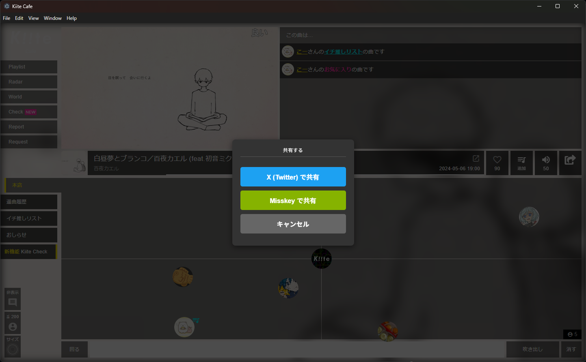
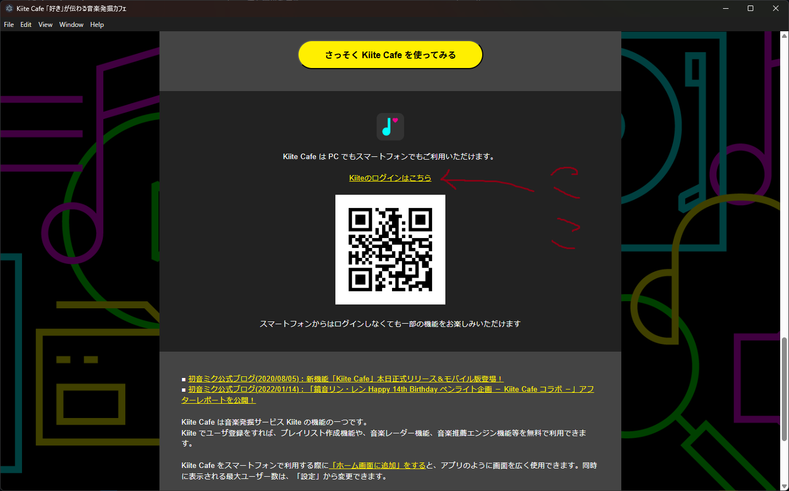

# Kiite Cafeをデスクトップで再生するためのシンプルなアプリ

## 注意

> [!caution]
> いろんなブログで解説されているであろう[kiitecafe-desktop](https://github.com/sevenc-nanashi/kiitecafe-desktop)ではありません！
> これはkiitecafe-desktopのバックグラウンド再生が自分の環境で動かなかったので適当に作ったものであり、機能はバックグラウンド再生とMisskey共有の二つしかありません。

## 機能

- 最小化状態でもバックグラウンド再生
- Misskeyでの共有

## ダウンロード

Windows: [exeファイルをダウンロード](https://github.com/minimarimo3/Kiite-Cafe-Wo-Kikitai/releases/download/v1.0.0/Kiite.Cafe.Wo.Kikitai.Desktop.Setup.1.0.0.exe)

macOS(ARM): [dmgファイルをダウンロード](https://github.com/minimarimo3/Kiite-Cafe-Wo-Kikitai/releases/download/v1.0.0/Kiite.Cafe.Wo.Kikitai.Desktop.-1.0.0-arm64.dmg)

> [!IMPORTANT]
> 「（アプリ名）は壊れているため開けません。ゴミ箱に入れる必要があります。」と表示されると思います。
> 
> これはAppleが、お前開発者登録（年一万五千円）しとらんやんけ！って言ってるだけで別にアプリが壊れてるわけじゃないです。
> 
> これが出たらいったんゴミ箱に入れた後「ターミナル」というアプリを開き、`xattr -rc ~/Downloads/Kiite.Cafe.Wo.Kikitai.Desktop.-1.0.0-arm64.dmg`を張り付けてEnterキーを押してください。
> 
> （ChatGPTとかに聞けばもっと分かりやすく教えてくれるでしょう）

macOS(X86_64): 面倒なので作ってません。連絡ありゃ作ると思います。

## 初回設定

最初に起動すると下のような画面が出るので、その画面の下の方にあるQRコードの真上にある「Kiiteのログインはこちら」からログインする。以上！

## 連絡・バグ報告・感想

[Googleフォーム](https://forms.gle/3ndDVkSmb6GgzzFE6)かissueからどうぞ。
